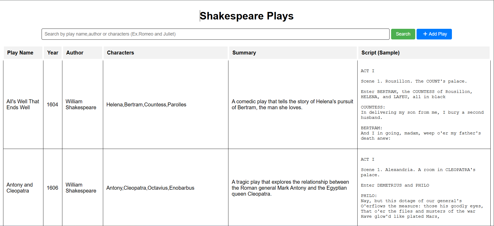
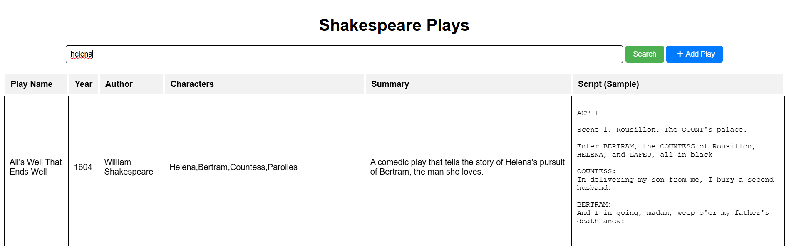
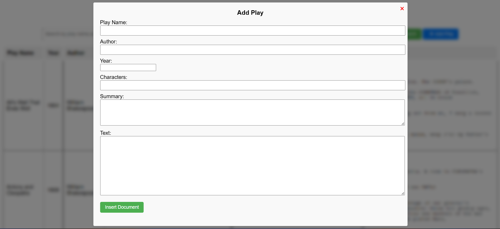
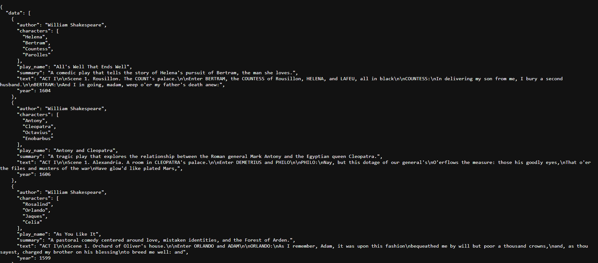

# FlaskSearch-API

A small Flask app that serves a searchable catalogue of Shakespeare plays. The play list is
read from a local JSON file; the search box queries an Elasticsearch index over HTTP.

## Screenshots

| Play list (`/`) | Search results |
| --- | --- |
|  |  |
| **Add Play form** | **`/api/plays` response** |
|  |  |

## What it does

- Renders a single page listing every play in `API/shakespeare_data.json` (38 entries).
- Runs a `multi_match` query against Elasticsearch across `play_name`, `author` and `characters`.
- Accepts new plays through a modal form, which POSTs the document into the Elasticsearch index.

Each play record has `play_name`, `author`, `year`, `characters` (a list), `summary`, and `text`.
The `text` field holds a short opening excerpt of the play, not the full script.

## How the two data sources fit together

This is the part worth understanding before you run it, because the file and the index are
independent:

- `GET /` and `GET /api/plays` read `shakespeare_data.json` directly. They work with
  Elasticsearch switched off.
- `POST /api/search_document` reads only from Elasticsearch. Nothing in the app copies the JSON
  file into the index at startup, so **search returns nothing until you index documents yourself**
  — either through the Add Play form or by bulk-loading the file (see below).

## Layout

```
API/
  run.py                  entry point, serves on 0.0.0.0:9090 with debug on
  main.py                 Flask app and routes
  es.py                   ESKNN class wrapping the Elasticsearch client
  config.py               index name and Elasticsearch host
  shakespeare_data.json   the 38 plays rendered by the UI
  templates/index.html    the whole frontend: table, search box, add-play modal
  static/style.css        styling
datset.json               unrelated Game of Thrones bulk-import sample, kept for reference
# Flask API Setup Instructions.txt   original setup notes for Elasticsearch on Windows
```

## Requirements

- Python 3.8+
- A reachable Elasticsearch node at `http://localhost:9200`

`es.py` connects over plain HTTP with no credentials and no TLS, so it expects an Elasticsearch
instance with security disabled — the default in 7.x, but not in 8.x, where you would need to turn
`xpack.security` off or add auth to the client. The client calls use the `body=` / `ignore=`
argument style of the 7.x Python client, so match the client to your server:

```bash
pip install Flask "elasticsearch>=7.17,<8"
```

There is no `requirements.txt` in the repo yet.

## Running it

Start Elasticsearch. With Docker:

```bash
docker run -d --name elasticsearch-container \
  -p 9200:9200 -p 9300:9300 \
  -e "discovery.type=single-node" \
  docker.elastic.co/elasticsearch/elasticsearch:7.15.0
```

Check it responds:

```bash
curl http://localhost:9200
```

Then start the app. `main.py` opens `shakespeare_data.json` with a relative path, so you have to
run it from inside `API/`:

```bash
cd API
python run.py
```

The app is at http://localhost:9090.

On startup it calls `indices.create` with an empty body, so the index is created with no explicit
mapping and Elasticsearch infers field types dynamically. If Elasticsearch is unreachable the app
still starts and prints `main.py -> Something went wrong with create index.`; the play list loads,
but search and insert will fail.

## Getting the plays into the index

The repo has no loader script. To make search return results for the bundled data, push the file
into the index once:

```bash
cd API
python -c "
import json
from elasticsearch import Elasticsearch
es = Elasticsearch(hosts=['http://localhost:9200'])
for play in json.load(open('shakespeare_data.json', encoding='utf-8')):
    es.index(index='shakespeareplay', body=play)
"
```

Confirm the count:

```bash
curl 'http://localhost:9200/shakespeareplay/_count'
```

## API

The `/api/` routes report success and failure in the `status` field of the JSON body rather
than through the HTTP status code, so a failed insert still comes back as HTTP 200.

### `GET /`

Renders `index.html`.

### `GET /api/plays`

Returns every play from the JSON file. Does not touch Elasticsearch.

```json
{
  "status": 200,
  "data": [
    {
      "play_name": "All's Well That Ends Well",
      "author": "William Shakespeare",
      "year": 1604,
      "characters": ["Helena", "Bertram", "Countess", "Parolles"],
      "summary": "A comedic play that tells the story of Helena's pursuit of Bertram, the man she loves.",
      "text": "ACT I\n\nScene 1. Rousillon. The COUNT's palace. ..."
    }
  ]
}
```

### `POST /api/search_document`

```bash
curl -X POST http://localhost:9090/api/search_document \
  -H "Content-Type: application/json" \
  -d '{"query": "Romeo and Juliet"}'
```

The query runs as a `multi_match` over `play_name`, `author` and `characters` only — `summary` and
`text` are not searched. The response contains the `_source` of each hit, with relevance scores
dropped:

```json
{
  "status": 200,
  "documents": [ { "play_name": "Romeo and Juliet", "author": "William Shakespeare", "...": "..." } ]
}
```

A request without a `query` key raises a `KeyError` and returns a 500.

### `POST /api/insert_document`

Indexes the JSON body as-is. No schema validation — whatever you send becomes the document.

```bash
curl -X POST http://localhost:9090/api/insert_document \
  -H "Content-Type: application/json" \
  -d '{
        "play_name": "Cymbeline",
        "author": "William Shakespeare",
        "year": 1611,
        "characters": ["Imogen", "Posthumus", "Iachimo"],
        "summary": "A late romance set in Roman Britain.",
        "text": "ACT I ..."
      }'
```

```json
{ "status": 200, "message": "Document inserted successfully" }
```

## Configuration

`API/config.py`:

```python
INDEX_NAME = 'shakespeareplay'
ESKNN_HOST = 'http://localhost:9200'
```

Both are read at import time. There is no environment-variable support — edit the file to point at
a different host or index.

## Known rough edges

These are real and unfixed, listed so nobody has to rediscover them:

- Documents added through the Add Play form send `characters` as a single string and `year` as a
  string, while the bundled JSON uses a list and an integer. Mixed types end up in the same index.
- A play added through the form goes into Elasticsearch only. It is not written back to
  `shakespeare_data.json`, so it disappears from the main list on reload and only shows up in
  search results.
- When a search returns nothing, the previous results stay on screen. The "No documents found" row
  sets `display: block` on a `<tr>`, which does not render correctly.
- `run.py` uses the Flask development server with `debug=True` on `0.0.0.0`. Fine locally, not
  something to expose.
- `es.py` catches index-creation failures with a bare `except`, so connection problems and genuine
  errors look the same from the caller.
- No tests, and no `requirements.txt`.

## Notes on the extra files

`datset.json` is an Elasticsearch bulk-format sample of Game of Thrones battles. It is not used by
the app and is unrelated to the Shakespeare data — it was kept as a reference for bulk-import
syntax. `# Flask API Setup Instructions.txt` contains the original, more verbose Windows setup
notes, including WSL2 and Elasticsearch configuration steps.
